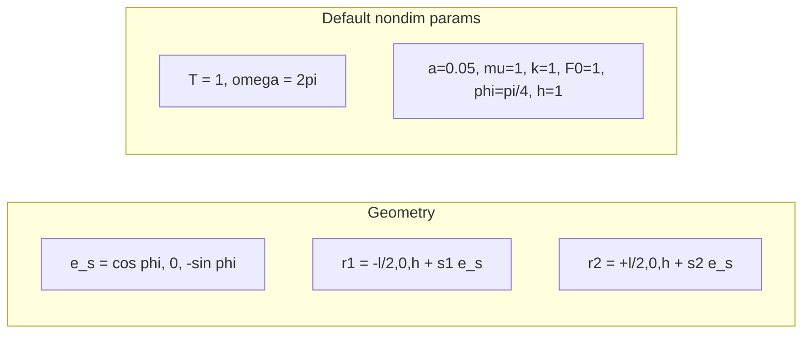
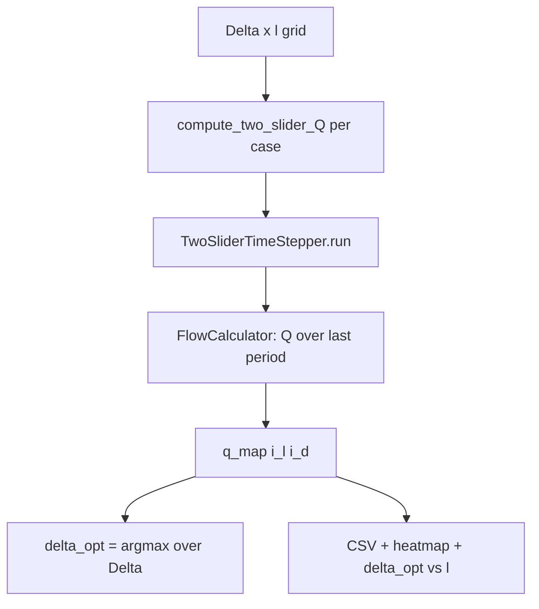

# 1次元スライダーモデル — 物理・数学解説レポート（exp01〜exp05）

修士論文第4章の 1D スライダーモデルを Python で段階的に再実装したプロジェクトについて、**exp05 まで**に実装した物理モデル・数式・数値手法・コード対応をまとめる。研究室メモ向けの中程度の深さとし、式番号は論文を参照するが、完全な導出は省略する。

---

## 目次

1. [はじめに](#1-はじめに)
2. [幾何・座標系・無次元化](#2-幾何座標系無次元化)
3. [第1段階 (exp01): 単一スライダー](#3-第1段階-exp01-単一スライダー)
4. [第2段階 (exp02): 2本スライダー・流体力学的相互作用](#4-第2段階-exp02-2本スライダー流体力学的相互作用)
5. [第3段階 (exp03): Δ × l パラメータ掃引](#5-第3段階-exp03--l-パラメータ掃引)
6. [第4段階 (exp04): 壁あり Blakelet（単点）](#6-第4段階-exp04-壁あり-blakelet単点)
7. [第5段階 (exp05): Blakelet Δ×l 掃引](#7-第5段階-exp05-blakelet-Δl-掃引)
8. [数値手法の要点](#8-数値手法の要点)
9. [コード ↔ 数式対応表](#9-コード--数式対応表)
10. [exp03 と exp05 の比較](#10-exp03-と-exp05-の比較)
11. [第6段階 exp06（予定・未実装）](#11-第6段階-exp06予定未実装)
12. [参考文献・関連ファイル](#12-参考文献関連ファイル)

---

## 1. はじめに

### 1.1 目的

繊毛の簡略化モデルとして、半径 $a$ のビーズ（スライダー）が傾き角 $\phi$ の直線上を振動する **1次元スライダーモデル** を数値的に解く。最終目標は、流体力学的相互作用により生じる **周期平均正味流量** $Q$ と **最適位相差** $\Delta_{\mathrm{opt}}$ がスライダー間距離 $l$ にどう依存するかを再現することである（論文第4章）。

### 1.2 段階的開発

| 段階 | スクリプト | 内容 | 状態 |
|------|-----------|------|------|
| exp01 | `experiments/exp01_single_slider.py` | 単一スライダー、壁なし | 完了 |
| exp02 | `experiments/exp02_two_sliders_nowall.py` | 2本スライダー、Oseen 相互作用 | 完了 |
| exp03 | `experiments/exp03_sweep_delta_l.py` | $\Delta \times l$ 掃引、$Q(\Delta,l)$ 解析 | 完了 |
| exp04 | `exp04_two_sliders_wall.py` | 壁あり Blakelet（単点検証） | 完了 |
| exp05 | `exp05_sweep_delta_l_wall.py` | 壁あり Blakelet Δ×l 掃引（論文数値解析） | 完了 |

各段階は `core/` の共通ライブラリを拡張し、実験スクリプトは履歴として残す設計である。

### 1.3 移動度と流量の扱い（重要）

| 段階 | 移動度 | 流量 $Q$ |
|------|--------|----------|
| exp01〜03 | Oseen（壁なし） | 式(2.61)（壁遠方近似の指標） |
| **exp04** | **Blakelet（壁 z=0）** | 式(2.61)(4.65)（移動度と整合） |

exp03 は Oseen 上の定性的検証。論文 Fig との **定量比較** は exp05 の **fine 掃引** で行う。

---

## 2. 幾何・座標系・無次元化

### 2.1 座標系

- **x**: 流れ方向（正味流量 $Q$ の評価方向）
- **y**: 流れに垂直（2D 問題として $y=0$ 平面内に配置）
- **z**: 壁法線方向。壁は $z=0$ に存在する想定だが、exp03 までは **壁境界条件を移動度に含めない**



### 2.2 スライダー直線の幾何

各スライダーは傾き角 $\phi$ の直線上をスカラー座標 $s_i(t)$ で運動する。

**直線方向の単位ベクトル**（`core/slider.py`）:

$$
\mathbf{e}_s = (\cos\phi,\ 0,\ -\sin\phi)
$$

$\phi > 0$ のとき $z$ 成分が負となり、ビーズは $z$ 負方向（壁側）へ傾く。

**直線に垂直な単位ベクトル**（`core/solver.py`）:

$$
\mathbf{e}_{s\perp} = (\sin\phi,\ 0,\ \cos\phi)
$$

$\mathbf{e}_s \cdot \mathbf{e}_{s\perp} = 0$ を満たす。

### 2.3 2体配置（exp02/exp03）

論文 式(4.1)(4.2) に合わせ、基準位置は

$$
\mathbf{r}_{1,\mathrm{base}} = \left(-\frac{l}{2},\ 0,\ h\right), \qquad
\mathbf{r}_{2,\mathrm{base}} = \left(+\frac{l}{2},\ 0,\ h\right)
$$

各ビーズの 3D 位置:

$$
\mathbf{r}_1(t) = \mathbf{r}_{1,\mathrm{base}} + s_1(t)\,\mathbf{e}_s, \qquad
\mathbf{r}_2(t) = \mathbf{r}_{2,\mathrm{base}} + s_2(t)\,\mathbf{e}_s
$$

ここで $l > 0$ は2体の中心間距離、$h > 0$ は壁からの基準高さである。

### 2.4 無次元化とデフォルトパラメータ

本実装では論文 2.4 節に準拠した無次元パラメータを `config/default_params.py` で一括管理する。主要なデフォルト値を下表に示す。

| 記号 | 意味 | デフォルト値 | 備考 |
|------|------|-------------|------|
| $a$ | ビーズ半径 | 0.05 | 移動度 $\gamma_0$ に使用 |
| $\mu$ | 粘性係数 | 1.0 | |
| $k$ | ばね定数 | 1.0 | 復元力 $-ks_i$ |
| $F_0$ | 駆動力振幅 | 1.0 | 論文 式(4.3) |
| $\omega$ | 角振動数 | $2\pi$ | 周期 $T = 2\pi/\omega = 1$ |
| $\phi$ | 傾き角 | $\pi/4$ | 45° |
| $h$ | 基準高さ | 1.0 | 流量式・配置に使用 |
| $l$ | 中心間距離 | 2.0 | exp02 単点 / exp03 掃引 |
| $\Delta$ | 位相差 | $\pi/2$ | exp02 単点 |
| $s_1(0), s_2(0)$ | 初期位置 | 0 | |

exp03 掃引範囲（fast / fine 共通）:

| パラメータ | 範囲 | 点数 |
|-----------|------|------|
| $\Delta$ | $[-\pi,\ \pi)$ | fast: 360 / fine: 8000 |
| $l$ | $[1.5,\ 6.0]$ | 19 |

---

## 3. 第1段階 (exp01): 単一スライダー

### 3.1 物理仮定

- **低レイノルズ数** Stokes 流れ: 慣性項を無視した過阻尼系
- **自由空間**: 壁の影響を移動度に含めない
- 並進 Stokes 抵抗: $6\pi\mu a\,\mathbf{v} = \mathbf{F}$

### 3.2 移動度

スカラー並進移動度（`core/hydrodynamics.py`）:

$$
\gamma_0 = \frac{1}{6\pi\mu a}
$$

直線方向の速度と力の関係:

$$
\frac{ds_1}{dt} = \gamma_0\, f_{\mathrm{total}}(t)
$$

### 3.3 力と運動方程式

**能動駆動力**（論文 式(4.3)）:

$$
f_{\mathrm{active}}(t) = F_0 \cos(\omega t)
$$

**線形復元力**（直線中心 $s_1=0$ が平衡点）:

$$
f_{\mathrm{spring}} = -k\, s_1
$$

**合力と ODE**:

$$
f_{\mathrm{total}} = F_0\cos(\omega t) - k s_1, \qquad
\frac{ds_1}{dt} = \gamma_0 \left(F_0\cos(\omega t) - k s_1\right)
$$

### 3.4 定常解（線形系）

過渡を捨てた定常状態では、$s_1(t)$ は駆動と同じ角振動数 $\omega$ で位相遅れ $\delta$ を伴う正弦振動:

$$
s_1(t) = A\cos(\omega t - \delta)
$$

振幅と位相遅れ（`tests/test_single_slider.py` で数値検証）:

$$
A = \frac{F_0}{\sqrt{k^2 + (\omega/\gamma_0)^2}}, \qquad
\delta = \arctan\!\left(\frac{\omega}{k\gamma_0}\right)
$$

### 3.5 流量の定義

**x 方向の流体への力**:

$$
F_x(t) = f_{\mathrm{total}}(t)\,\cos\phi
$$

**瞬時流量**（論文 式(2.61)、単体版）:

$$
q_x(t) = \frac{h}{\pi\mu}\, F_x(t)
$$

**周期平均正味流量**:

$$
Q = \frac{1}{T}\int_0^T q_x(t)\,dt
$$

実装では積分区間を **最後の1周期（steady window）** に限定する（第6章参照）。

### 3.6 単一スライダーで $Q \approx 0$ となる理由

駆動力が $F_0\cos(\omega t)$ と時間反転対称な単一スライダーでは、定常状態の $F_x(t)$ も $\omega t \to -\omega t$ で符号反転する対称性を持ち、1周期積分が相殺される。論文 4.3.6 節の $Q_0 = 0$ に対応する。

**成功基準**（exp01）:

$$
|Q| < 10^{-4} \cdot \frac{F_0 h}{\pi\mu}
$$

### 3.7 実装

| 処理 | モジュール |
|------|-----------|
| 力の計算 | `core/slider.py` — `Slider` |
| 移動度 | `core/hydrodynamics.py` — `Mobility` |
| 時間積分 | `core/solver.py` — `TimeStepper` |
| 流量 | `core/flow_rate.py` — `FlowCalculator` |
| 実験実行 | `experiments/exp01_single_slider.py` |

---

## 4. 第2段階 (exp02): 2本スライダー・流体力学的相互作用

### 4.1 駆動力と位相規約

2体目に位相差 $\Delta$ を導入する。**実装の符号規約**（`core/solver.py` — `_active_forces`）:

$$
f_{\mathrm{active},1}(t) = F_0\cos(\omega t + \Delta), \qquad
f_{\mathrm{active},2}(t) = F_0\cos(\omega t)
$$

すなわち **スライダー1が $+\Delta$ の位相、スライダー2が基準位相（0）** である。

各スライダーの合力:

$$
f_{i,\mathrm{total}} = f_{\mathrm{active},i}(t) - k\, s_i
$$

### 4.2 移動度行列（壁なし Oseen）

2体間の流体力学的相互作用を、Stokeslet の **Oseen テンソル** で記述する（`core/hydrodynamics.py` — `TwoSliderMobility`）。

**自己移動度**（3×3 単位行列に比例）:

$$
\mathbf{M}_{aa} = \gamma_0\,\mathbf{I}, \qquad \gamma_0 = \frac{1}{6\pi\mu a}
$$

**核テンソル**（論文 式(2.40)）:

$$
\mathbf{R} = \mathbf{r}_i - \mathbf{r}_j, \quad R = |\mathbf{R}|, \qquad
\mathbf{J}(\mathbf{r}_i, \mathbf{r}_j) = \mathbf{I} + \frac{\mathbf{R}\otimes\mathbf{R}}{R^2}
$$

**交差移動度**（論文 式(2.39)）:

$$
\mathbf{M}_{ab} = \frac{1}{8\pi\mu R}\,\mathbf{J}
$$

3D 速度—力関係:

$$
\dot{\mathbf{r}}_i = \mathbf{M}_{aa}\mathbf{F}_i + \mathbf{M}_{ab}\mathbf{F}_j \quad (i \neq j)
$$

ここで $\mathbf{F}_i$ はスライダー $i$ に作用する **3D ベクトル力**（後述）。

### 4.3 拘束条件（1D スライダー拘束）

各ビーズは直線 $\mathbf{e}_s$ 上のみ自由に動く。垂直方向速度ゼロ:

$$
\dot{\mathbf{r}}_i \cdot \mathbf{e}_{s\perp} = 0
$$

能動力・復元力は直線方向スカラー $f_{i,\mathrm{total}}$ として与えられるが、流体力学的相互作用により **拘束力** $\lambda_i$ が $\mathbf{e}_{s\perp}$ 方向に生じる:

$$
\mathbf{F}_i = f_{i,\mathrm{total}}\,\mathbf{e}_s + \lambda_i\,\mathbf{e}_{s\perp}
$$

$\lambda_1, \lambda_2$ は2つの拘束式から決定する。`compute_velocities` では 2×2 連立

$$
\mathbf{A}\,\boldsymbol{\lambda} = \mathbf{b}
$$

を `numpy.linalg.solve` で解き（`core/hydrodynamics.py` L303–317）、その後

$$
\dot{\mathbf{r}}_i = \mathbf{M}_{aa}\mathbf{F}_i + \mathbf{M}_{ab}\mathbf{F}_j
$$

を評価する。

**スカラー速度**（ODE の状態変数への接続）:

$$
\frac{ds_i}{dt} = \dot{\mathbf{r}}_i \cdot \mathbf{e}_s
$$

### 4.4 状態方程式

状態ベクトル $\mathbf{y} = [s_1,\ s_2]^\mathsf{T}$。各積分ステップで

1. $\mathbf{r}_1(s_1), \mathbf{r}_2(s_2)$ を更新
2. $\mathbf{M}_{ab}(\mathbf{r}_1, \mathbf{r}_2)$ を再計算（距離 $R$ 依存 → **幾何非線形**）
3. 拘束付き速度 $(\dot{s}_1, \dot{s}_2)$ を求める

$$
\frac{d\mathbf{y}}{dt} = \mathrm{RHS}(t,\ \mathbf{y})
$$

`TwoSliderTimeStepper`（`core/solver.py`）が RK45 または Euler で積分する。

### 4.5 2体の瞬時流量と周期平均

exp02/exp03 共通の流量定義（`core/flow_rate.py` — `instantaneous_q_x_two_slider`）。論文 式(2.61)(2.62) および第4章 式(4.65) に対応:

**各スライダーの有効高さ**:

$$
z_i(t) = h - s_i(t)\sin\phi
$$

**x 方向力**:

$$
F_{x,i}(t) = f_{i,\mathrm{total}}(t)\,\cos\phi
$$

**瞬時流量**:

$$
q_x(t) = \frac{1}{\pi\mu}\left[z_1(t)\,F_{x,1}(t) + z_2(t)\,F_{x,2}(t)\right]
$$

**周期平均**:

$$
Q = \frac{1}{T}\int_{\text{steady window}} q_x(t)\,dt
$$

2体の位相がずれると $q_x(t)$ の時間平均が一般に **非ゼロ** となり、正味輸送が生じる。

### 4.6 exp02 の出力

`experiments/exp02_two_sliders_nowall.py` は単一 $(l, \Delta)$ 点で:

- 時系列 $s_1(t), s_2(t)$, $f_1(t), f_2(t)$
- 相図 $s_2$ vs $s_1$
- 周期平均 $Q$、相関 $\mathrm{corr}(s_1, s_2)$

を `output/exp02_two_sliders_nowall/<timestamp>/` に保存する。

---

## 5. 第3段階 (exp03): Δ × l パラメータ掃引

### 5.1 目的

壁なし Oseen モデルのまま、位相差 $\Delta$ と中心間距離 $l$ を系統的に変化させ、次を求める。

1. **$Q(\Delta, l)$ ヒートマップ** — 相互作用による流量のパラメータ依存
2. **$\Delta_{\mathrm{opt}}(l)$** — 各 $l$ における $Q$ 最大の位相
3. **固定 $l$ における $Q(\Delta)$** — 論文 Fig.4.2 相当（デフォルト $l=2$）

### 5.2 掃引グリッドと積分プリセット

`config/default_params.py` — `resolve_exp03_config(mode)`:

| 項目 | fast（探索用） | fine（論文比較用） |
|------|---------------|-------------------|
| $\Delta$ 点数 | 360（約 1° 刻み） | 8000 |
| $l$ 点数 | 19 | 19 |
| 積分手法 | 前進 Euler | RK45（`scipy.integrate.solve_ivp`） |
| 積分周期数 | 8 | 10 |
| 1周期あたり評価点数 | 150 | 300 |
| 総ケース数 | $19 \times 360 = 6{,}840$ | $19 \times 8000 = 152{,}000$ |

### 5.3 計算パイプライン



**1ケースの流れ**（`core/two_slider.py` — `compute_two_slider_Q`）:

1. `TwoSliderMobility` + `TwoSliderTimeStepper` で $(s_1, s_2)$ を時間積分
2. `FlowCalculator.compute_two_slider_Q_from_result` で定常窓1周期の $Q$ を計算
3. スカラー $Q$ を返す

**全グリッド**（`experiments/exp03_sweep_delta_l.py`）:

- `_build_cases` で $(l_i, \Delta_j)$ のリストを生成
- `core/sweep.py` — `sweep_with_progress` で直列または `ProcessPoolExecutor` 並列実行
- 結果を `q_map[i_l, i_d]` に格納

**最適位相の抽出**:

$$
\Delta_{\mathrm{opt}}(l_i) = \arg\max_{\Delta_j} Q(\Delta_j, l_i)
$$

実装: `np.argmax(q_map, axis=1)`（各 $l$ 行で最大 $Q$ の列インデックスを取得）。

### 5.4 期待される物理像

- **単一スライダー（exp01）**: $Q \approx 0$
- **2体 + 位相差（exp02/exp03）**: 流体力学的相互作用により $Q \neq 0$
- **$Q(\Delta)$ のピーク**: $l=2$、fast モード（36点縮小グリッド）のテストでは $\Delta_{\mathrm{opt}} \approx -90°$ 付近（antiplectic 分支、`tests/test_exp03_sweep.py`）
- **$l$ 依存**: 相互作用強度が距離 $R = |\mathbf{r}_1 - \mathbf{r}_2|$ に依存するため、$\Delta_{\mathrm{opt}}(l)$ は一般に $l$ に対して非自明な曲線となる

### 5.5 出力物

`output/exp03_sweep_delta_l/<timestamp>/`:

| ファイル | 内容 |
|---------|------|
| `parameters.json` | mode, workers, 全パラメータ |
| `q_delta_l.csv` | $l, \Delta, Q$ |
| `delta_opt_vs_l.csv` | $l, \Delta_{\mathrm{opt}}, Q_{\max}$ |
| `q_vs_delta_fixed_l.csv` | 固定 $l$ における $Q(\Delta)$ |
| `Q_heatmap_delta_l.png` | $Q(\Delta, l)$ カラーマップ |
| `delta_opt_vs_l.png` | $\Delta_{\mathrm{opt}}(l)$ |
| `Q_vs_delta_fixed_l.png` | 固定 $l$ の $Q(\Delta)$ |

---

## 6. 第4段階 (exp04): 壁あり Blakelet（単点）

### 6.1 移動度（論文最終形）

exp04 では `BlakeletTwoSliderMobility`（`core/hydrodynamics.py`）を用いる。

**自己項**（式(2.51)(2.52)）:

$$\mathbf{M}_{aa} = \gamma_0 \mathbf{I} + \hat{M}(z/a), \quad \gamma_0 = \frac{1}{6\pi\mu a}$$

**相互項**（式(2.44)(4.17)）:

$$\mathbf{M}_{ab} = \mathbf{G}(\mathbf{r}_i, \mathbf{r}_j)$$

鏡像点 $\mathbf{r}_0^I = (x_0, y_0, -z_0)$ と $P = \mathrm{diag}(1,1,-1)$ を含む Blakelet テンソル。拘束解法は exp02 と同一（式(4.5)）。

**近似**: 相互項で Faxén 演算子 $F_x F_y$ は省略（exp02 の Oseen と同レベル）。

### 6.2 1ケース $Q$ と単点実験

| 処理 | 実装 |
|------|------|
| Blakelet 積分 + $Q$ | `compute_two_slider_Q_blakelet`（`core/two_slider.py`） |
| 単点パイプライン | `experiments/exp04_two_sliders_wall.py` |
| パラメータ | `EXP04_DEFAULTS`, `resolve_exp04_solver_config` |

単点 `summary.txt` には `Q_blakelet` と同条件 Oseen 参考値 `Q_oseen_reference` を記録する。

---

## 7. 第5段階 (exp05): Blakelet Δ×l 掃引

exp03 と同型のグリッド（$\Delta \in [-\pi,\pi)$, $l \in [1.5, 6]$）を Blakelet 上で掃引する。論文第4章の数値解析（Fig 4.3–4.5）の再現は本段階の **fine** モードで行う。

| 項目 | 実装 |
|------|------|
| 掃引本体 | `experiments/exp05_sweep_delta_l_wall.py` |
| 設定 | `resolve_exp05_config("fast"\|"fine")` |
| 1ケース | `compute_two_slider_Q_blakelet` |

出力形式は exp03 と同一（CSV、ヒートマップ、$\Delta_{\mathrm{opt}}(l)$）。

---

## 8. 数値手法の要点

### 8.1 過渡除去（steady window）

駆動開始直後は初期条件の影響が残る。**過渡を除去**するため:

1. 総 $n_{\mathrm{periods}}$ 周期分を積分（exp01: 8、exp03 fine: 10 など）
2. **最後の1周期のみ** を定常窓（steady window）として $Q$ を評価

定常窓の開始時刻: $t_{\mathrm{steady}} = t_{\mathrm{start}} + (n_{\mathrm{periods}} - 1)\,T$

### 8.2 時間積分

| 手法 | 用途 | 実装 |
|------|------|------|
| RK45 | 高精度（exp02, exp03/exp05 fine） | `scipy.integrate.solve_ivp`, `rtol=1e-8`, `atol=1e-10` |
| 前進 Euler | 高速探索（exp03/exp05 fast） | 固定刻み $t_{\mathrm{eval}}$ グリッド上 |

**注意**: Euler と RK45 では $Q$ の **定量値が一致しない**。論文比較には fine（RK45）を用いる。

### 8.3 周期平均 $Q$ の数値積分

定常窓上の $q_x(t)$ に対し **台形公式**（`numpy.trapezoid`）:

$$
Q \approx \frac{1}{T}\int_{t_{\mathrm{steady}}}^{t_{\mathrm{steady}}+T} q_x(t)\,dt
$$

### 8.4 並列 sweep（exp03 / exp05）

- ワーカー数: デフォルト `os.cpu_count() - 1`
- Windows 互換: ワーカー関数 `_run_one_case` は各 sweep スクリプトモジュール直下（pickle 要件）
- 進捗表示: `core/progress.py` — `SweepProgressTracker`（スループットベース ETA）

---

## 9. コード ↔ 数式対応表

| 物理量・処理 | 数式 | 実装 |
|-------------|------|------|
| 直線単位ベクトル | $\mathbf{e}_s = (\cos\phi, 0, -\sin\phi)$ | `Slider.e_s`, `TwoSliderTimeStepper._e_s` |
| 垂直単位ベクトル | $\mathbf{e}_{s\perp} = (\sin\phi, 0, \cos\phi)$ | `TwoSliderTimeStepper._e_s_perp` |
| 能動駆動力（1体） | $F_0\cos(\omega t)$ | `Slider.f_active` |
| 能動駆動力（2体） | $F_0\cos(\omega t+\Delta)$, $F_0\cos(\omega t)$ | `TwoSliderTimeStepper._active_forces` |
| 復元力 | $-k s_i$ | `Slider.f_spring`, `TwoSliderTimeStepper` 内 |
| 並進移動度 | $\gamma_0 = 1/(6\pi\mu a)$ | `stokes_translation_mobility` |
| Oseen 核 | $\mathbf{J} = \mathbf{I} + \mathbf{R}\otimes\mathbf{R}/R^2$ | `stokeslet_kernel_tensor` |
| Oseen テンソル | $\mathbf{M}_{ab} = \mathbf{J}/(8\pi\mu R)$ | `oseen_tensor` |
| Blakelet テンソル | $\mathbf{G}(\mathbf{r},\mathbf{r}_0)$ 式(2.44) | `blakelet_mobility_tensor` |
| 壁自己項 | $\hat{M}(z/a)$ 式(2.51) | `wall_reflection_mobility` |
| 拘束（Oseen） | $\dot{\mathbf{r}}\cdot\mathbf{e}_{s\perp}=0$ | `TwoSliderMobility.compute_velocities` |
| 拘束（Blakelet） | 同上 | `BlakeletTwoSliderMobility.compute_velocities` |
| 1体 ODE | $ds_1/dt = \gamma_0 f_{\mathrm{total}}$ | `TimeStepper._rhs` |
| 2体 ODE | $d[s_1,s_2]/dt$ | `TwoSliderTimeStepper._rhs` |
| 瞬時流量（1体） | $q_x = (h/\pi\mu) F_x$ | `FlowCalculator.instantaneous_q_x` |
| 瞬時流量（2体） | $q_x = [z_1 F_{x,1}+z_2 F_{x,2}]/(\pi\mu)$ | `instantaneous_q_x_two_slider` |
| 周期平均 | $Q = (1/T)\int q_x\,dt$ | `FlowCalculator.period_average_Q` |
| 1ケース $Q$（Oseen） | 積分 + 定常窓平均 | `compute_two_slider_Q` |
| 1ケース $Q$（Blakelet） | 積分 + 定常窓平均 | `compute_two_slider_Q_blakelet` |
| パラメータ掃引（Oseen） | $Q(\Delta, l)$ | `exp03_sweep_delta_l.py` |
| パラメータ掃引（Blakelet） | $Q(\Delta, l)$ | `exp05_sweep_delta_l_wall.py` |
| 最適位相 | $\arg\max_\Delta Q$ | `np.argmax(q_map, axis=1)` |

---

## 10. exp03 と exp05 の比較

| 項目 | exp03 | exp05 |
|------|-------|-------|
| 移動度 | Oseen | Blakelet |
| 流量式 | 式(2.61) | 式(2.61)(4.65)（整合） |
| 掃引グリッド | 同一 | 同一 |
| 論文 Fig 定量比較 | 定性的参考 | **fine モードで実施** |

exp03 はパイプライン検証と定性的トレンド。論文第4章の数値解析（Fig 4.3–4.5）の再現は exp05 fine 掃引の結果を用いる。

---

## 11. 第6段階 exp06（予定・未実装）

exp05（壁 + Blakelet 掃引）完了後に **段階的に** 実装する。現状は [`experiments/exp06_sweep_delta_theta.py`](experiments/exp06_sweep_delta_theta.py) のみプレースホルダ（`core` 幾何・`config` プリセット・掃引本体は未追加）。

### 11.1 目的（論文外の拡張研究）

- 中心間距離 $l^*$ を固定
- **x–y 平面**内の相対配置角 $\theta$ を掃引
- $Q(\Delta,\theta)$、$\Delta_{\mathrm{opt}}(\theta)$ を評価し、**配置に応じた流量最大化戦略が異なるか**を検証

### 11.2 実装予定の配置角（参考）

対称配置の案（$\theta=0$ で論文の $\pm l/2$ 配置と一致）:

$$
\mathbf{r}_{1,\mathrm{base}} = \left(-\frac{l}{2}\cos\theta,\ -\frac{l}{2}\sin\theta,\ h\right), \quad
\mathbf{r}_{2,\mathrm{base}} = \left(+\frac{l}{2}\cos\theta,\ +\frac{l}{2}\sin\theta,\ h\right)
$$

### 11.3 実装順序（予定）

1. exp04–exp05: Blakelet 移動度 + 壁 + Δ×l 掃引（完了）
2. exp06: `TwoSliderLayout`（または同等）と `layout_angle` を `core` に追加
3. exp06: `EXP06_*` 設定と `exp06_sweep_delta_theta.py` 本体
4. exp06: 可視化・テスト

本番掃引は **Blakelet 上** で行う。

---

## 12. 参考文献・関連ファイル

### 12.1 論文の主要式

| 式番号 | 内容 |
|--------|------|
| (2.39) | Oseen 移動度テンソル $\mathbf{M}_{ab}$ |
| (2.40) | Stokeslet 核テンソル $\mathbf{J}$ |
| (2.44) | Blakelet $\mathbf{G}$ |
| (2.51) | 壁自己項 $\hat{M}$ |
| (2.61) | 瞬時流量 $q_x$（Blakelet 遠方近似） |
| (2.62) | 複数スライダーへの拡張 |
| (4.1)(4.2) | 2体の基準位置 |
| (4.3) | 能動駆動力 $F_0\cos(\omega t)$ |
| (4.65) | 2体の周期平均流量 $Q$ |

### 12.2 リポジトリ内ファイル

| パス | 役割 |
|------|------|
| `config/default_params.py` | 無次元パラメータの一括管理 |
| `core/slider.py` | 力・幾何（1体） |
| `core/hydrodynamics.py` | 移動度（Oseen + Blakelet + 拘束） |
| `core/solver.py` | 時間積分 |
| `core/flow_rate.py` | $q_x$, $Q$ |
| `core/two_slider.py` | 1ケース $Q$（Oseen / Blakelet） |
| `core/sweep.py` | 並列パラメータ掃引 |
| `experiments/exp04_two_sliders_wall.py` | 第4段階単点 |
| `experiments/exp05_sweep_delta_l_wall.py` | 第5段階掃引 |
| `experiments/exp06_sweep_delta_theta.py` | 第6段階（プレースホルダ） |
| `tests/test_blakelet_mobility.py` | Blakelet 移動度・パイプライン |
| `tests/test_exp05_sweep.py` | exp05 掃引設定・並列一致 |

### 12.3 実行例

```bash
cd cilia_simulation

# exp01
python experiments/exp01_single_slider.py

# exp02
python experiments/exp02_two_sliders_nowall.py

# exp03（探索）
python experiments/exp03_sweep_delta_l.py

# exp03（論文比較・Oseen）
python experiments/exp03_sweep_delta_l.py --mode fine

# exp04 単点（Blakelet）
python experiments/exp04_two_sliders_wall.py

# exp05 掃引（論文比較・Blakelet）
python experiments/exp05_sweep_delta_l_wall.py --mode fine

# テスト
python -m unittest discover tests -v
```

---

*本レポートは exp05 完了時点（2026年6月）の実装に基づく。*
